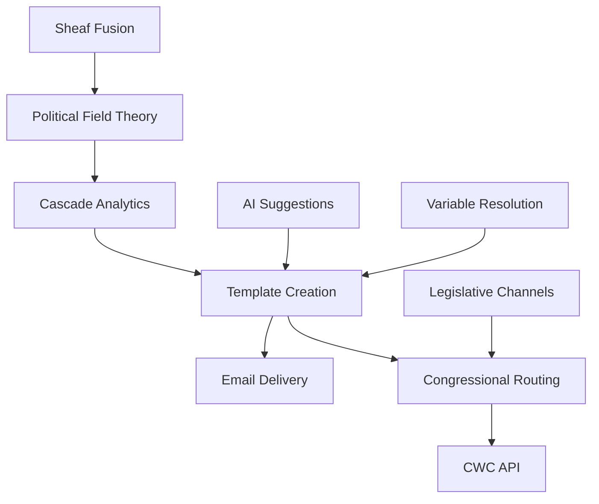

# Feature Status Dashboard

Last Updated: August 30, 2025

This document tracks the status of all features in the Communique platform, from production-ready features to research experiments.

## Production Features ✅

These features are fully implemented, tested, and available to all users.

| Feature               | Status        | Location                            | Documentation                            |
| --------------------- | ------------- | ----------------------------------- | ---------------------------------------- |
| Template Creation     | ✅ Production | `/src/lib/core/templates/`          | [Templates Guide](./guides/templates.md) |
| Congressional Routing | ✅ Production | `/src/lib/congress/`                | [Congress Guide](./guides/congress.md)   |
| OAuth Authentication  | ✅ Production | `/src/lib/core/auth/`               | [Auth Guide](./guides/auth.md)           |
| Email Delivery        | ✅ Production | `/src/lib/services/emailService.ts` | [Delivery Guide](./guides/delivery.md)   |
| User Profiles         | ✅ Production | `/src/routes/api/user/`             | [User API](./api/user.md)                |
| Session Management    | ✅ Production | `/src/lib/core/auth/`               | [Sessions](./guides/sessions.md)         |

## Beta Features 🧪

These features are implemented and functional but still being tested and refined.

| Feature                 | Status  | Enable Flag        | Location                                       | Documentation                          |
| ----------------------- | ------- | ------------------ | ---------------------------------------------- | -------------------------------------- |
| Cascade Analytics       | 🧪 Beta | `ENABLE_BETA=true` | `/src/lib/experimental/cascade/`               | [Cascade Analytics](./beta/cascade.md) |
| Legislative Channels    | 🧪 Beta | `ENABLE_BETA=true` | `/src/lib/services/channelResolver.ts`         | [Channels](./beta/channels.md)         |
| Viral Pattern Generator | 🧪 Beta | `ENABLE_BETA=true` | `/src/lib/services/viral-pattern-generator.ts` | [Viral Patterns](./beta/viral.md)      |
| Geolocation Services    | 🧪 Beta | Auto-enabled       | `/src/lib/services/geolocation.ts`             | [Geolocation](./beta/geo.md)           |

### How to Enable Beta Features

Add to your `.env` file:

```bash
ENABLE_BETA=true
PUBLIC_ENABLE_BETA=true
```

## Roadmap Features 📋

These features are planned but not yet implemented. See [ROADMAP.md](./ROADMAP.md) for detailed specifications.

| Feature                  | Status     | Timeline | Specification                                                             | Current State                                  |
| ------------------------ | ---------- | -------- | ------------------------------------------------------------------------- | ---------------------------------------------- |
| AI Suggestions           | 📋 Planned | Q2 2025  | [ROADMAP.md#ai](./ROADMAP.md#ai-suggestions)                              | Stubbed in `/src/lib/features/ai-suggestions/` |
| Variable Resolution      | 📋 Planned | Q3 2025  | [ROADMAP.md#variables](./ROADMAP.md#template-variable-resolution-roadmap) | Design phase                                   |
| Template Personalization | 📋 Planned | Q3 2025  | [ROADMAP.md#personalization](./ROADMAP.md#personalization)                | Schema defined                                 |
| User Writing Style       | 📋 Planned | Q4 2025  | [ROADMAP.md#writing](./ROADMAP.md#writing-style)                          | Database model only                            |
| Smart Routing            | 📋 Planned | Q4 2025  | [ROADMAP.md#routing](./ROADMAP.md#smart-routing)                          | Concept phase                                  |

## Research Features 🔬

These features are experimental implementations of academic research. They are not intended for production use but inform future development.

| Feature                | Status      | Enable Flag            | Location                                 | Theory/Paper                                                                          |
| ---------------------- | ----------- | ---------------------- | ---------------------------------------- | ------------------------------------------------------------------------------------- |
| Political Field Theory | 🔬 Research | `ENABLE_RESEARCH=true` | `/src/lib/experimental/political-field/` | [Political Fields](./architecture/mathematical-foundations-cid.md#political-fields)   |
| Sheaf Fusion           | 🔬 Research | `ENABLE_RESEARCH=true` | `/src/lib/experimental/sheaf/`           | [Sheaf Theory](./architecture/mathematical-foundations-cid.md#sheaf-cohomology)       |
| Percolation Engine     | 🔬 Research | `ENABLE_RESEARCH=true` | `/src/lib/experimental/percolation/`     | [Information Percolation](./architecture/community-information-theory.md#percolation) |
| Community Intersection | 🔬 Research | `ENABLE_RESEARCH=true` | `/src/lib/experimental/political-field/` | [Community Theory](./architecture/community-information-theory.md#intersection)       |

### How to Enable Research Features

Add to your `.env` file:

```bash
ENABLE_RESEARCH=true
```

⚠️ **Warning**: Research features are experimental and may have performance implications. They should not be enabled in production environments.

## Deprecated Features ⚠️

These features are being phased out or replaced.

| Feature                | Status        | Replacement           | Removal Date |
| ---------------------- | ------------- | --------------------- | ------------ |
| Legacy Modal System    | ⚠️ Deprecated | Unified Modal System  | Q1 2025      |
| Old API Client         | ⚠️ Deprecated | Unified API Client    | Q1 2025      |
| Manual District Lookup | ⚠️ Deprecated | Automated Geolocation | Q2 2025      |

## Feature Dependencies

Some features depend on others to function properly:



## Testing Features

### Unit Tests

- Production features: Required 80%+ coverage
- Beta features: Required 60%+ coverage
- Research features: Optional

### E2E Tests

- Production features: Required
- Beta features: Recommended
- Research features: Not required

### Performance Benchmarks

- Production features: < 100ms response time
- Beta features: < 500ms response time
- Research features: No requirements

## Feature Flags in Code

### Checking Feature Status

```typescript
import { isFeatureEnabled, getFeatureStatus } from '$lib/features/config';

// Check if a feature is enabled
if (isFeatureEnabled('AI_SUGGESTIONS')) {
	// Use AI suggestions
}

// Get feature status
const status = getFeatureStatus('CASCADE_ANALYTICS');
```

### Component-Level Feature Flags

```svelte
<script>
	import { useFeature } from '$lib/features/config';

	const showAI = useFeature('AI_SUGGESTIONS');
</script>

{#if showAI}
	<AIComponent />
{/if}
```

## Contributing New Features

1. **Propose**: Open an issue describing the feature
2. **Design**: Add specification to ROADMAP.md
3. **Implement**: Start in `/src/lib/features/` or `/src/lib/experimental/`
4. **Test**: Add appropriate tests
5. **Document**: Update this file
6. **Release**: Move through stages: Research → Beta → Production

## Metrics & Analytics

### Feature Adoption (Production)

- Template Creation: 100% (core feature)
- Congressional Routing: 45% (US users only)
- OAuth Login: 78% (vs guest users)

### Beta Feature Usage

- Cascade Analytics: 12% of power users
- Legislative Channels: 8% of templates
- Viral Patterns: 23% of shares

### Research Impact

- Papers published: 2
- Concepts integrated: 3
- Future features informed: 5

## Questions?

- **Technical questions**: Open an issue on GitHub
- **Feature requests**: Use the feature request template
- **Research collaboration**: Contact research@communique.app
