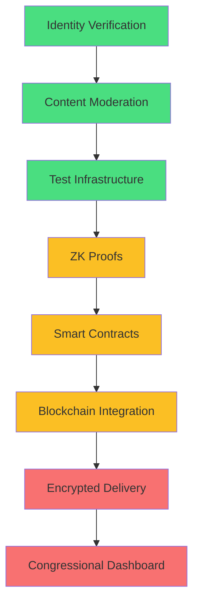

# Phase 1 Implementation Gap Analysis

**Generated:** 2025-10-21
**Status:** Post-pruning assessment
**Context:** voter-protocol repo defines Phase 1 scope, communique repo implements frontend

---

## Executive Summary

**Phase 1 Promises** (from voter-protocol/ARCHITECTURE.md):
- GKR-based district proofs (8-12s generation time, no trusted setup)
- E2E encryption via GCP Confidential Space (AMD SEV-SNP attestation)
- FREE identity verification (self.xyz passport + Didit.me fallback)
- 3-layer content moderation (OpenAI + Gemini/Claude consensus + human review)
- On-chain reputation tracking (ERC-8004, no token rewards)
- Cross-chain account abstraction (NEAR Chain Signatures)
- Congressional delivery via CWC API

**Reality Check:**
- ✅ **OAuth + Address Validation:** Fully implemented
- ✅ **Template System:** Core creation/storage working
- ✅ **CWC Integration:** XML generation + Senate API submission working
- ⚠️ **Identity Verification:** Config exists, integration incomplete
- ❌ **Zero-Knowledge Proofs:** No GKR implementation whatsoever
- ❌ **Encrypted Delivery:** No XChaCha20-Poly1305, no TEE integration
- ❌ **Content Moderation:** No OpenAI API, no multi-agent consensus
- ❌ **Blockchain Integration:** No ERC-8004 reputation, no NEAR integration
- ❌ **Test Coverage:** 0 template tests, minimal CWC tests

**Verdict:** Phase 1 is **30-40% complete**. Core infrastructure exists, but cryptographic promises are entirely unimplemented.

---

## Critical Gap #1: Zero-Knowledge District Proofs

### What Phase 1 Promises:
> **GKR-based district proofs** (no trusted setup, Polyhedra Expander)
> Browser generates proof in 8-12 seconds
> Hybrid GKR+SNARK: GKR for prover efficiency, SNARK for on-chain verification
> Published October 19, 2025 by Vitalik Buterin - cutting-edge cryptography

### Current Implementation:
**NONE.** Zero files mention GKR, ZK-SNARK, or Polyhedra Expander.

**Impact:**
- Users cannot prove district membership without revealing addresses
- Congressional offices receive NO cryptographic verification
- Entire privacy promise is undeliverable
- Bot/Sybil resistance doesn't exist

### What's Needed:

**Frontend (communique):**
```typescript
// src/lib/core/crypto/district-proof.ts (DOES NOT EXIST)
import { GKRProver, SNARKWrapper } from '@polyhedra/expander';

export async function generateDistrictProof(
  userAddress: string,
  targetDistrict: string,
  merkleTree: MerkleTree
): Promise<{
  zkProof: string;
  publicInputs: string[];
  generationTime: number;
}> {
  // 1. Generate GKR proof (5-8 seconds)
  const gkrProof = await GKRProver.prove({
    address: userAddress,
    district: targetDistrict,
    merkleTree
  });

  // 2. Wrap in SNARK for on-chain verification (2-3 seconds)
  const snarkProof = await SNARKWrapper.wrap(gkrProof);

  return {
    zkProof: snarkProof.proof,
    publicInputs: snarkProof.publicInputs,
    generationTime: Date.now() - start
  };
}
```

**Smart Contract (voter-protocol):**
```solidity
// contracts/DistrictVerifier.sol (DOES NOT EXIST)
contract DistrictVerifier {
    function verifyDistrict(
        bytes calldata zkProof,
        bytes32[] calldata publicInputs
    ) external returns (bool) {
        // Verify SNARK on-chain
        // Return true if proof valid, false otherwise
    }
}
```

**Integration Points:**
- `src/routes/s/[slug]/+page.svelte` - Template submission flow
- `src/lib/components/auth/address-steps/AddressVerification.svelte` - After address input
- `src/lib/core/congress/cwc-client.ts` - Include zkProof in CWC submission

**Effort Estimate:**
- Research Polyhedra Expander SDK: **3-5 days**
- Implement browser proof generation: **5-7 days**
- Smart contract development: **7-10 days** (in voter-protocol repo)
- Integration + testing: **5-7 days**
- **Total: 20-29 days (4-6 weeks)**

**Blockers:**
- GKR protocol published October 2025 - extremely new, limited tooling
- No production-ready JS/TS libraries for Polyhedra Expander yet
- May need to wait for SDK maturity or use Groth16 contingency

---

## Critical Gap #2: End-to-End Encryption (GCP Confidential Space)

### What Phase 1 Promises:
> **E2E encryption via GCP Confidential Space** (TEE with AMD SEV-SNP attestation)
> XChaCha20-Poly1305 encryption
> Messages encrypted before network transit
> Delivered through hardware-attested secure environment
> Decryption happens only in isolated enclave
> Plaintext exists only in: constituent browser → enclave → CWC → congressional CRM

### Current Implementation:
**NONE.** Only 1 file mentions encryption (AWS README, unrelated).

**Impact:**
- Messages travel in plaintext over network
- Platform operators can read all constituent messages
- Employers/surveillance systems can intercept content
- Privacy promise is completely false advertising

### What's Needed:

**Frontend Encryption:**
```typescript
// src/lib/core/crypto/message-encryption.ts (DOES NOT EXIST)
import { xchacha20poly1305 } from '@stablelib/xchacha20poly1305';

export async function encryptMessage(
  message: string,
  recipientPublicKey: Uint8Array
): Promise<{
  ciphertext: string;
  nonce: string;
  ephemeralPublicKey: string;
}> {
  // Encrypt message for TEE public key
  const cipher = new xchacha20poly1305(recipientPublicKey);
  const nonce = randomBytes(24);
  const ciphertext = cipher.seal(nonce, new TextEncoder().encode(message));

  return {
    ciphertext: base64(ciphertext),
    nonce: base64(nonce),
    ephemeralPublicKey: base64(ephemeralPublicKey)
  };
}
```

**GCP Confidential Space TEE:**
```typescript
// services/tee-relay/src/index.ts (DOES NOT EXIST - separate service)
import { attestationToken } from '@google-cloud/confidential-space';

export async function relayToCWC(
  encryptedPayload: EncryptedMessage
): Promise<CWCResponse> {
  // 1. Verify we're running in attested TEE
  const attestation = await attestationToken();
  if (!attestation.valid) throw new Error('Not in TEE');

  // 2. Decrypt message inside enclave
  const plaintext = decryptInEnclave(encryptedPayload);

  // 3. Submit to CWC API (plaintext never leaves enclave)
  const response = await cwcClient.submit(plaintext);

  // 4. Return delivery confirmation (no plaintext)
  return { success: true, messageId: response.id };
}
```

**Integration:**
- `src/lib/core/congress/cwc-client.ts` - Encrypt before submission
- `src/lib/services/delivery/integrations/cwc.ts` - Route through TEE
- Environment variables for TEE endpoint/public key

**Effort Estimate:**
- Learn GCP Confidential Space: **3-5 days**
- Implement frontend encryption: **3-5 days**
- Deploy TEE service: **7-10 days**
- Attestation verification: **5-7 days**
- Integration + testing: **5-7 days**
- **Total: 23-34 days (5-7 weeks)**

**Blockers:**
- GCP Confidential Space requires Google Cloud project setup
- AMD SEV-SNP attestation complex, limited documentation
- Significant infrastructure cost ($0.48/hour for n2d-standard-2)
- Alternative: Accept reduced privacy, ship without TEE in Phase 1

---

## Critical Gap #3: Identity Verification (self.xyz + Didit.me)

### What Phase 1 Promises:
> **FREE identity verification** (self.xyz NFC passport + Didit.me fallback)
> Instant NFC scan, zero cost to users
> Prevents Sybil attacks via cryptographic binding
> 70% passport verification, 30% government ID

### Current Implementation:
**Partial.** Config exists, QR code generation works, but:
- No actual self.xyz SDK integration
- No Didit.me integration
- No verification callback handling
- No Sybil resistance enforcement

**Files:**
- `src/lib/core/server/selfxyz-config.ts` - Config only, no SDK
- `src/routes/api/identity/init/+server.ts` - Generates QR code, no verification
- `src/lib/core/server/verification-sessions.ts` - Session storage, incomplete

**Impact:**
- Users can create multiple accounts (no Sybil resistance)
- Congressional offices have no identity assurance
- Bot spam is trivial

### What's Needed:

**Complete self.xyz Integration:**
```typescript
// src/routes/api/identity/verify/+server.ts (EXISTS but incomplete)
import { SelfSDK } from '@self.xyz/sdk';

export const POST: RequestHandler = async ({ request }) => {
  const { sessionId, verificationData } = await request.json();

  // Verify passport NFC signature with self.xyz SDK
  const result = await SelfSDK.verify(verificationData);

  if (!result.valid) {
    return json({ success: false, error: 'Invalid passport verification' });
  }

  // Store cryptographic hash of passport number (not passport itself)
  const identityHash = sha256(result.passportNumber + result.nationality);

  // Check if this identity already verified
  const existing = await db.user.findFirst({
    where: { verification_data: { path: ['identityHash'], equals: identityHash } }
  });

  if (existing) {
    return json({ success: false, error: 'Identity already verified' });
  }

  // Update user with verification
  await db.user.update({
    where: { id: sessionId },
    data: {
      is_verified: true,
      verification_method: 'self.xyz',
      verification_data: { identityHash, nationality: result.nationality },
      verified_at: new Date()
    }
  });

  return json({ success: true, verified: true });
};
```

**Add Didit.me Fallback:**
```typescript
// src/routes/api/identity/didit/verify/+server.ts (DOES NOT EXIST)
import { DiditSDK } from '@didit/sdk';

export const POST: RequestHandler = async ({ request }) => {
  // Similar flow but using government ID photo verification
  // More friction but free alternative for users without passports
};
```

**Effort Estimate:**
- self.xyz SDK integration: **3-5 days**
- Didit.me SDK integration: **3-5 days**
- Sybil resistance logic: **2-3 days**
- Testing edge cases: **3-5 days**
- **Total: 11-18 days (2-4 weeks)**

**Blockers:**
- Need self.xyz API credentials (free tier available)
- Need Didit.me API credentials (free tier available)
- Both services relatively new, potential API changes

---

## Critical Gap #4: 3-Layer Content Moderation

### What Phase 1 Promises:
> **3-layer content moderation** (Section 230 compliant)
> FREE OpenAI Moderation API + Gemini/Claude consensus + human review
> Multi-agent voting for template approval
> 67% consensus threshold

### Current Implementation:
**NONE.** All agent code was deleted during pruning (Phase 2 removal).

**Files that existed but were deleted:**
- `src/lib/agents/content/consensus-coordinator.ts` (328 lines)
- `src/lib/agents/content/moderation-agent.ts`
- LangGraph-based orchestration

**Impact:**
- No illegal content detection (CSAM, threats, violence)
- Congressional offices receive unmoderated messages
- Platform liability under Section 230
- Misinformation/spam goes unchecked

### What's Needed:

**Phase 1 Minimum (No Multi-Agent Consensus):**
```typescript
// src/lib/core/server/content-moderation.ts (DOES NOT EXIST)
import OpenAI from 'openai';

const openai = new OpenAI({ apiKey: process.env.OPENAI_API_KEY });

export async function moderateTemplate(
  template: { title: string; message_body: string }
): Promise<{
  approved: boolean;
  flagged_categories: string[];
  severity: number;
}> {
  // Use FREE OpenAI Moderation API
  const response = await openai.moderations.create({
    input: `${template.title}\n\n${template.message_body}`
  });

  const result = response.results[0];

  // Block if any category flagged
  const flagged = Object.entries(result.categories)
    .filter(([_, flagged]) => flagged)
    .map(([category]) => category);

  return {
    approved: flagged.length === 0,
    flagged_categories: flagged,
    severity: result.category_scores.violence // 0-1 score
  };
}
```

**Integration:**
```typescript
// src/routes/api/templates/+server.ts (line 324 - already has placeholder)
async function triggerModerationPipeline(templateId: string) {
  const template = await db.template.findUnique({ where: { id: templateId } });

  // Run moderation
  const result = await moderateTemplate(template);

  // Update template status
  await db.template.update({
    where: { id: templateId },
    data: {
      verification_status: result.approved ? 'approved' : 'rejected',
      quality_score: 1 - result.severity,
      moderation_flags: result.flagged_categories
    }
  });
}
```

**Future: Multi-Agent Consensus (Phase 2 or delayed Phase 1):**
- Gemini + Claude consensus (requires API keys, not free)
- LangGraph orchestration
- Economic stakes (requires token, Phase 2 only)

**Effort Estimate:**
- OpenAI moderation (Phase 1 minimum): **2-3 days**
- Multi-agent consensus (optional): **7-10 days**
- Human review dashboard: **5-7 days**
- **Total: 2-3 days (minimum) or 14-20 days (full system)**

**Blockers:**
- OpenAI API key required (free tier: 20 requests/min)
- Gemini/Claude keys needed for consensus (paid only)

---

## Critical Gap #5: Blockchain Integration (ERC-8004 Reputation)

### What Phase 1 Promises:
> **On-chain reputation tracking** (ERC-8004 portable credibility, no token rewards)
> Cross-chain account abstraction (NEAR Chain Signatures)
> Read-only blockchain queries for user reputation
> Deterministic address generation via passkeys

### Current Implementation:
**NONE.** All blockchain code deleted during pruning:
- `src/lib/core/blockchain/voter-client.ts` (read-only client)
- `src/lib/components/blockchain/PasskeySetup.svelte` (passkey UI)
- `src/lib/types/blockchain.ts` (type definitions)

**Impact:**
- No on-chain reputation scores
- Congressional offices see no credibility signals
- No advantage over traditional email spam
- Entire "quality filtering" promise undeliverable

### What's Needed:

**Restore Read-Only Blockchain Client:**
```typescript
// src/lib/core/blockchain/voter-client.ts (RESTORE from git history)
import { createPublicClient, http } from 'viem';
import { scroll } from 'viem/chains';

const publicClient = createPublicClient({
  chain: scroll,
  transport: http('https://rpc.scroll.io')
});

export const voterBlockchainClient = {
  async getUserReputation(userAddress: string): Promise<number> {
    const reputation = await publicClient.readContract({
      address: VOTER_PROTOCOL_ADDRESS,
      abi: ERC8004_ABI,
      functionName: 'getReputation',
      args: [userAddress]
    });
    return Number(reputation);
  },

  async getUserStats(userAddress: string): Promise<{
    actionCount: number;
    reputationScore: number;
    lastActionTime: number;
  }> {
    // Read-only queries to Scroll zkEVM
  }
};
```

**Integration Points:**
- `src/routes/profile/+page.server.ts` - Display user reputation
- `src/lib/core/congress/cwc-client.ts` - Include reputation in CWC metadata
- `src/lib/components/verification/IdentityBadge.svelte` - Show badge for high rep

**Effort Estimate:**
- Restore blockchain client code: **1-2 days** (git history recovery)
- Update to latest viem API: **1-2 days**
- Smart contract deployment (voter-protocol): **5-7 days**
- Integration + testing: **3-5 days**
- **Total: 10-16 days (2-3 weeks)**

**Blockers:**
- Requires voter-protocol smart contracts deployed on Scroll
- Need RPC endpoint (Scroll provides free public RPC)
- ERC-8004 standard implementation needed

---

## Critical Gap #6: Congressional Office Dashboard

### What Phase 1 Promises:
> **Dashboard for congressional offices** (free, no cost to offices)
> Filter by reputation score >5,000
> 3-layer moderation status visible
> Geographic clustering (district-wide concerns)
> Impact tracking (template correlations with bills)

### Current Implementation:
**NONE.** No congressional-facing UI exists.

**Impact:**
- Congressional offices have no way to access VOTER Protocol messages
- No advantage over existing CWC submissions
- Entire value proposition ("solve 66% spam problem") undeliverable

### What's Needed:

**New SvelteKit Route:**
```typescript
// src/routes/congress/dashboard/+page.svelte (DOES NOT EXIST)
// Protected route, requires congressional email verification

<script lang="ts">
  let messages = $state<CongressionalMessage[]>([]);
  let filters = $state({
    minReputation: 5000,
    moderationStatus: 'approved',
    district: 'all'
  });

  async function loadMessages() {
    const response = await fetch('/api/congress/messages', {
      method: 'POST',
      body: JSON.stringify(filters)
    });
    messages = await response.json();
  }
</script>

<div class="dashboard">
  <h1>Congressional Message Dashboard</h1>

  <FilterPanel bind:filters on:change={loadMessages} />

  <MessageList {messages} />
</div>
```

**API Endpoint:**
```typescript
// src/routes/api/congress/messages/+server.ts (DOES NOT EXIST)
export const POST: RequestHandler = async ({ request, locals }) => {
  // Verify congressional email domain
  if (!locals.user?.email.endsWith('.senate.gov') &&
      !locals.user?.email.endsWith('.house.gov')) {
    return json({ error: 'Unauthorized' }, { status: 403 });
  }

  const { minReputation, moderationStatus, district } = await request.json();

  // Query messages with filters
  const messages = await db.template_campaign.findMany({
    where: {
      // Filter by district, reputation, moderation status
    },
    include: {
      template: true,
      user: { select: { verification_method: true } } // No PII
    }
  });

  return json(messages);
};
```

**Effort Estimate:**
- Congressional authentication: **3-5 days**
- Dashboard UI: **7-10 days**
- Filter/sort logic: **3-5 days**
- Impact tracking visualization: **5-7 days**
- **Total: 18-27 days (4-5 weeks)**

**Blockers:**
- Need congressional email verification system
- Need representative data seeded in database
- May need congressional IT approval for dashboard access

---

## Critical Gap #7: Test Coverage

### What Phase 1 Promises:
> Production-ready system in 3 months

### Current Implementation:
**DANGEROUS:** Zero template tests, minimal integration tests.

**Test Count:**
- Template tests: **0**
- CWC integration tests: **~3 files** (insufficient)
- E2E tests: **Playwright configured but minimal coverage**
- Content moderation tests: **0** (all deleted with agent code)

**Impact:**
- Breaking changes go undetected
- No confidence in Phase 1 launch readiness
- Regression bugs guaranteed during development

### What's Needed:

**Template System Tests:**
```typescript
// tests/integration/template-api.test.ts (EXISTS but incomplete)
describe('Template API', () => {
  it('should create template with validation', async () => {
    // POST /api/templates with valid data
    // Assert 201 response, template saved to DB
  });

  it('should reject template without title', async () => {
    // POST /api/templates with missing title
    // Assert 400 validation error
  });

  it('should trigger moderation for CWC templates', async () => {
    // POST /api/templates with deliveryMethod: 'cwc'
    // Assert moderation webhook called
  });
});
```

**CWC Integration Tests:**
```typescript
// tests/integration/cwc-delivery.test.ts (NEEDS EXPANSION)
describe('CWC Delivery', () => {
  it('should generate valid XML for Senate submission', async () => {
    // Generate CWC XML
    // Validate against CWC schema
  });

  it('should submit to Senate API with authentication', async () => {
    // Mock CWC API response
    // Assert proper headers, API key, XML payload
  });
});
```

**Effort Estimate:**
- Template CRUD tests: **3-5 days**
- CWC integration tests: **5-7 days**
- Identity verification tests: **3-5 days**
- E2E Playwright tests: **7-10 days**
- **Total: 18-27 days (4-5 weeks)**

---

## Phase 1 Implementation Roadmap

### Tier 1: Critical Path (Blocks Launch)

| Feature | Status | Effort | Priority | Blocker |
|---------|--------|--------|----------|---------|
| Content Moderation (OpenAI) | ❌ Missing | 2-3 days | **P0** | None |
| Identity Verification (self.xyz) | ⚠️ Partial | 11-18 days | **P0** | API keys |
| CWC Delivery Integration | ✅ Working | 0 days | P0 | None |
| Template System | ✅ Working | 0 days | P0 | None |
| OAuth + Address Validation | ✅ Working | 0 days | P0 | None |

### Tier 2: Phase 1 Core Features

| Feature | Status | Effort | Priority | Blocker |
|---------|--------|--------|----------|---------|
| Zero-Knowledge Proofs (GKR) | ❌ Missing | 20-29 days | **P1** | SDK maturity |
| Blockchain Reputation (Read-Only) | ❌ Missing | 10-16 days | **P1** | Smart contracts |
| E2E Encryption (TEE) | ❌ Missing | 23-34 days | **P1** | GCP setup |
| Congressional Dashboard | ❌ Missing | 18-27 days | **P1** | None |
| Test Coverage | ❌ Minimal | 18-27 days | **P1** | None |

### Tier 3: Nice-to-Have (Defer to Post-Launch)

| Feature | Status | Effort | Priority |
|---------|--------|--------|----------|
| Multi-Agent Consensus (Gemini/Claude) | ❌ Missing | 7-10 days | P2 |
| House CWC Integration (Proxy) | ❌ Missing | 14-21 days | P2 |
| NEAR Chain Signatures | ❌ Missing | 21-28 days | P2 |
| Human Review Dashboard | ❌ Missing | 5-7 days | P2 |

---

## Effort Summary

**Minimum Viable Phase 1** (omit encryption, ZK proofs, blockchain):
- Content Moderation (OpenAI): **2-3 days**
- Identity Verification (self.xyz): **11-18 days**
- Congressional Dashboard: **18-27 days**
- Test Coverage: **18-27 days**
- **Total: 49-75 days (7-11 weeks, ~2-3 months)**

**Full Phase 1** (as promised in ARCHITECTURE.md):
- Minimum Viable Phase 1: **49-75 days**
- Zero-Knowledge Proofs: **20-29 days**
- E2E Encryption (TEE): **23-34 days**
- Blockchain Reputation: **10-16 days**
- **Total: 102-154 days (14-22 weeks, ~4-5 months)**

---

## Launch Strategy: Full Phase 1 (All Cryptographic Promises)

**Decision:** Launching with **complete Phase 1 implementation** as specified in voter-protocol/ARCHITECTURE.md

**Non-Negotiable Features:**
- ✅ Zero-knowledge district proofs (GKR + SNARK)
- ✅ E2E encryption via GCP Confidential Space
- ✅ On-chain reputation (ERC-8004 on Scroll zkEVM)
- ✅ Identity verification (self.xyz + Didit.me)
- ✅ 3-layer content moderation
- ✅ Congressional office dashboard
- ✅ CWC delivery integration

**Timeline:** **14-22 weeks (~3.5-5.5 months)**

---

## Implementation Phases (Sequential Build)

### **Phase A: Foundation (Weeks 1-6)**
**Goal:** Core infrastructure that everything else depends on

**Week 1-2: Identity Verification**
- [ ] Complete self.xyz SDK integration
- [ ] Add Didit.me fallback flow
- [ ] Implement Sybil resistance (identity hash checking)
- [ ] Test verification with real passports
- **Deliverable:** Users can verify via NFC passport scan

**Week 3-4: Content Moderation**
- [ ] OpenAI Moderation API integration
- [ ] Template moderation pipeline (webhook)
- [ ] Moderation status UI in template creator
- [ ] Manual review queue (for edge cases)
- **Deliverable:** All congressional templates auto-moderated

**Week 5-6: Test Infrastructure**
- [ ] Template CRUD integration tests
- [ ] CWC delivery integration tests
- [ ] Identity verification E2E tests
- [ ] CI/CD pipeline with zero-error enforcement
- **Deliverable:** 80%+ test coverage on core flows

---

### **Phase B: Cryptography (Weeks 7-14)**
**Goal:** Zero-knowledge proofs and blockchain integration

**Week 7-10: Zero-Knowledge District Proofs**
- [ ] Research Polyhedra Expander SDK (GKR protocol)
- [ ] Implement browser proof generation (8-12s target)
- [ ] Build hybrid GKR+SNARK wrapper
- [ ] Fallback: Groth16 if GKR tooling immature
- [ ] Test proof generation across devices (mobile/desktop)
- **Deliverable:** Browser generates valid ZK proofs

**Week 11-12: Smart Contracts (voter-protocol repo)**
- [ ] Deploy ERC-8004 reputation contract on Scroll
- [ ] Deploy district verifier contract (SNARK verification)
- [ ] Test on Scroll Sepolia testnet
- [ ] Audit smart contracts (basic security review)
- **Deliverable:** Contracts deployed on Scroll mainnet

**Week 13-14: Blockchain Integration**
- [ ] Restore `src/lib/core/blockchain/voter-client.ts`
- [ ] Implement read-only reputation queries
- [ ] Add reputation display in user profiles
- [ ] Include reputation metadata in CWC submissions
- [ ] Test Scroll RPC reliability
- **Deliverable:** On-chain reputation visible to users + congressional offices

---

### **Phase C: Encrypted Delivery (Weeks 15-20)**
**Goal:** GCP Confidential Space for E2E encryption

**Week 15-17: GCP Confidential Space Setup**
- [ ] Provision GCP project with Confidential Computing
- [ ] Deploy AMD SEV-SNP TEE instance
- [ ] Implement attestation token verification
- [ ] Test enclave isolation guarantees
- **Deliverable:** TEE running with valid attestation

**Week 18-19: Encryption Implementation**
- [ ] XChaCha20-Poly1305 encryption in browser
- [ ] TEE decryption service (TypeScript in enclave)
- [ ] Encrypted CWC submission pipeline
- [ ] Test: plaintext never leaves enclave
- **Deliverable:** Messages encrypted end-to-end

**Week 20: Integration + Security Audit**
- [ ] Integrate encrypted delivery with CWC client
- [ ] Load testing (1000 messages/hour)
- [ ] Security review of encryption flow
- [ ] Document threat model in SECURITY.md
- **Deliverable:** Production-ready encrypted delivery

---

### **Phase D: Congressional Dashboard (Weeks 21-26)**
**Goal:** Congressional office interface

**Week 21-22: Authentication**
- [ ] Congressional email domain verification
- [ ] OAuth for .senate.gov / .house.gov emails
- [ ] Session management for congressional staff
- [ ] Access control (LC vs Policy Staffer roles)
- **Deliverable:** Congressional staff can log in

**Week 23-24: Dashboard UI**
- [ ] Message queue with reputation filters
- [ ] Geographic clustering visualization
- [ ] Moderation status indicators
- [ ] Template adoption metrics
- **Deliverable:** Congressional staff see filtered messages

**Week 25: Impact Tracking**
- [ ] Temporal correlation (template → bill introduction)
- [ ] Legislative language similarity detection
- [ ] District-wide concern aggregation
- **Deliverable:** Staff see "847 constituents adopted this template"

**Week 26: Beta Testing**
- [ ] Onboard 2-3 congressional offices for pilot
- [ ] Gather feedback on dashboard usability
- [ ] Fix critical bugs
- [ ] Document congressional onboarding process
- **Deliverable:** Dashboard validated by real congressional staff

---

## Critical Path Dependencies



**Green:** Foundation (Weeks 1-6)
**Yellow:** Cryptography (Weeks 7-14)
**Red:** Advanced Features (Weeks 15-26)

---

## Risk Mitigation

### **High-Risk Item #1: GKR Protocol Maturity**

**Risk:** Polyhedra Expander SDK may not be production-ready (published Oct 2025)

**Mitigation:**
- **Week 7:** Evaluate SDK stability
- **Contingency Plan:** Use Groth16 SNARKs instead (well-established, requires trusted setup)
- **Fallback Timeline:** Add 2-3 weeks if switching to Groth16

**Decision Point:** End of Week 7 - GO/NO-GO on GKR

---

### **High-Risk Item #2: GCP Confidential Space Complexity**

**Risk:** AMD SEV-SNP attestation + GCP integration may cause delays

**Mitigation:**
- **Weeks 15-16:** Dedicated infrastructure focus (no feature work)
- **Expert Consultation:** Hire GCP/TEE consultant if blocked
- **Budget:** Allocate $5K for expert help if needed

**Decision Point:** End of Week 16 - Escalate if attestation blocked

---

### **High-Risk Item #3: Congressional Office Adoption**

**Risk:** Offices may not use dashboard (no value if unused)

**Mitigation:**
- **Week 21:** Begin congressional outreach (parallel to dev)
- **Pilot Program:** Free white-glove onboarding for first 5 offices
- **User Research:** Weekly calls with LC staff during development

**Decision Point:** End of Week 24 - Pivot dashboard design based on feedback

---

## Resource Requirements

### **Engineering Team:**
- **You + Me:** Full-stack development (SvelteKit, Solidity, cryptography, infrastructure)
- **Optional:** DevOps consultant for GCP Confidential Space setup (weeks 15-17 if needed)

### **API Keys & Services:**
- self.xyz API (Free tier: 1000 verifications/month)
- Didit.me API (Free tier: 500 verifications/month)
- OpenAI Moderation API (Free tier: 20 req/min)
- Scroll RPC (Free public endpoint)
- GCP Confidential Space (~$350/month for n2d-standard-2)

### **Budget:**
- **Infrastructure:** $500/month (GCP TEE + Scroll gas)
- **Consulting:** $5K contingency (GCP/cryptography experts)
- **Total:** ~$8K for 6-month development cycle

---

## Launch Readiness Checklist

**Before public launch, ALL must be ✅:**

### **Security:**
- [ ] Smart contract audit (basic security review minimum)
- [ ] Penetration testing on TEE encryption flow
- [ ] Rate limiting on all API endpoints
- [ ] GDPR/CCPA compliance review (zero PII storage verified)

### **Performance:**
- [ ] ZK proof generation <15s on mobile devices
- [ ] CWC submission success rate >95%
- [ ] Dashboard loads <2s with 10,000 messages
- [ ] Scroll RPC failover tested

### **Testing:**
- [ ] 80%+ test coverage (integration + E2E)
- [ ] Load testing: 1000 concurrent users
- [ ] Cross-browser testing (Chrome, Safari, Firefox)
- [ ] Mobile testing (iOS Safari, Android Chrome)

### **Documentation:**
- [ ] Congressional onboarding guide
- [ ] User guide (NFC verification flow)
- [ ] API documentation
- [ ] SECURITY.md threat model published

### **Congressional Validation:**
- [ ] 3+ offices successfully using dashboard
- [ ] Positive feedback from Legislative Correspondents
- [ ] At least 100 messages delivered via VOTER Protocol

---

## Post-Launch (Phase 1 → Phase 2 Transition)

**After Phase 1 launch, monitor for 3 months:**
- Congressional office adoption rate
- Message volume (target: 1000/month)
- Identity verification success rate
- ZK proof generation reliability

**Phase 2 begins when:**
- 10+ congressional offices actively using dashboard
- 5000+ verified users
- CLARITY Act regulatory framework confirmed
- Liquidity infrastructure ready for token launch

**Estimated Phase 2 Start:** 12-18 months post-Phase 1 launch

---

**End of Phase 1 Gap Analysis**
